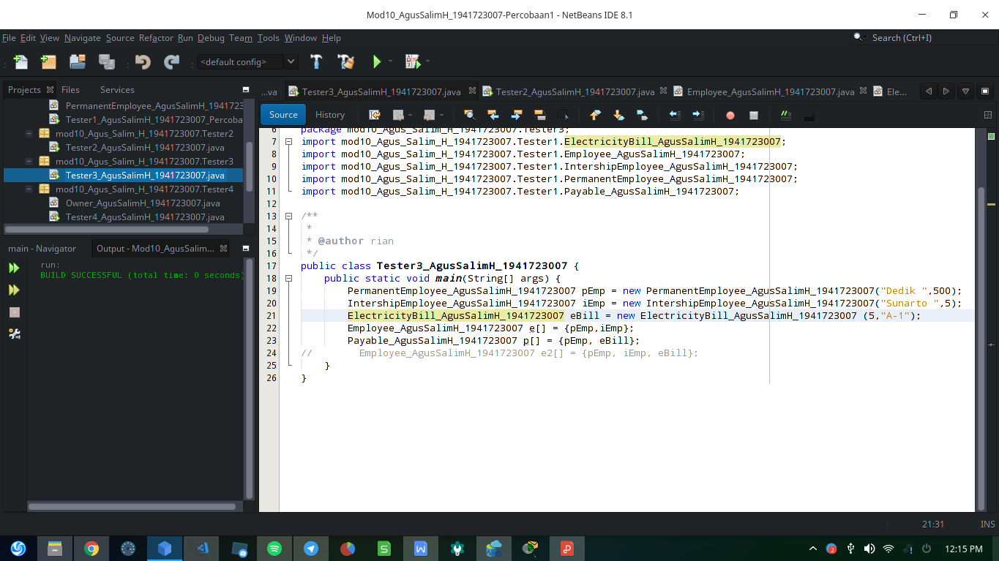
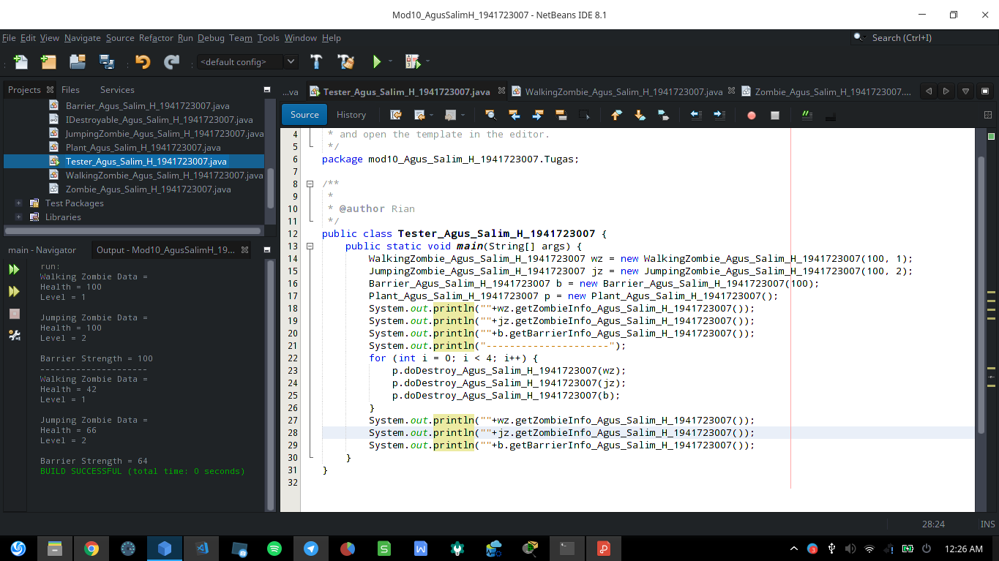

# Laporan Modul 10 Polimorfisme

# Kompetensi

    Setelah melakukan percobaan pada jobsheet ini, diharapkan mahasiswa mampu:
    a. Memahami konsep dan bentuk dasar polimorfisme
    b. Memahami konsep virtual method invication
    c. Menerapkan polimorfisme pada pembuatan heterogeneous collection
    d. Menerapkan polimorfisme pada parameter/argument method
    e. Menerapkan object casting untuk meng-ubah bentuk objek

# Ringkasan Materi
Polimorfisme merupakan kemampuan suatu objek untuk memiliki banyak 
bentuk. Penggunaan polimorfisme yang paling umum dalam OOP terjadi 
ketika ada referensi super class yang digunakan untuk merujuk ke objek dari 
sub class. Dengan kata lain, ketika ada suatu objek yang dideklarasikan dari 
super class, maka objek tersebut bisa diinstansiasi sebagai objek dari sub 
class. Dari uraian tersebut bisa dilihat bahwa konsep polimorfisme bisa 
diterapkan pada class-class yang memiliki relasi inheritance.
Adapun ilustrasi dri Philimorfisme sebagai berikut :
    1. Virtual method Invocation
    2. Heterogeneous Collection
    3. Polymorphic Argument
    4. Operator instanceof
    5. Object Casting

# Percobaan 1 – Bentuk dasar polimorfisme

 link kode program: 

 [ElectricityBill](../../src/10_Polimorfisme/Tester1/ElectricityBill_AgusSalimH_1941723007.java)
  
  [Employee](../../src/10_Polimorfisme/Tester1/Employee_AgusSalimH_1941723007.java)
  
  [IntershipEmployee](../../src/10_Polimorfisme/Tester1/IntershipEmployee_AgusSalimH_1941723007.java)
  
  [Payable](../../src/10_Polimorfisme/Tester1/Payable_AgusSalimH_1941723007.java)
  
  [PermanentEmployee](../../src/10_Polimorfisme/Tester1/PermanentEmployee_AgusSalimH_1941723007.java)
  
  [Main_Tester1](../../src/10_Polimorfisme/Tester1/Tester1_AgusSalimH_1941723007_Percobaan1.java)
  
  
    Pertanyaan :

    1. Class apa sajakah yang merupakan turunan dari class Employee?
    2. Class apa sajakah yang implements ke interface Payable?
    3. Perhatikan class Tester1, baris ke-10 dan 11. Mengapa e, bisa diisi 
    dengan objek pEmp (merupakan objek dari class 
    PermanentEmployee) dan objek iEmp (merupakan objek dari class 
    InternshipEmploye) ?
    4. Perhatikan class Tester1, baris ke-12 dan 13. Mengapa p, bisa diisi 
    dengan objek pEmp (merupakan objek dari class 
    PermanentEmployee) dan objek eBill (merupakan objek dari class 
    ElectricityBill) ?
    5. Coba tambahkan sintaks:
    p = iEmp;
    e = eBill;
    pada baris 14 dan 15 (baris terakhir dalam method main) ! Apa yang 
    menyebabkan error?
    6. Ambil kesimpulan tentang konsep/bentuk dasar polimorfisme!

    Jawab : 

    1. PermanentEmployee_AgusSalimH_1941723007 dan IntershipEmployee_AgusSalimH_1941723007
    2. ElectricityBill_AgusSalimH_1941723007 dan PermanentEmployee_AgusSalimH_1941723007
    3. Karena pada PermanentEmployee_AgusSalimH_1941723007 dan IntershipEmployee_AgusSalimH_1941723007 sudah extends ke Employee_AgusSalimH_1941723007 oleh karena itu e dapat mengakses eBill dan pEmp 
    4. Begitupun pada payable, p bisa mengakses eBill dan pEmp karena merupakan interface dari class tersebut.
    5. hasil jika di tambahkan sintask :
    e = eBill; // Akan eror karena
    ElectricityBill_AgusSalimH_1941723007 tidak ada keterkaitan dengan Employee_AgusSalimH_1941723007 
    p = iEmp; juga akan eror karena iEmp tidak interface ke Payable_AgusSalimH_1941723007, bisa tidak eror jika cast ke Payable_AgusSalimH_1941723007 ( p = (Payable_AgusSalimH_1941723007) iEmp; )
    6. Kesimpulan tentang polimorfisme adalah tentang bentuk yang fleksibell dan juga dapat di aplikasikan di object sub class maupun super class yang memiliki relasi Inheritance, dapat juga di interface karena pada class mempunyai interface maka class tersebut akan secara otomatis mengikuti interface-nya

# Percobaan 2 – Virtual method invocation

 link kode program: 

  [Main_Tester2](../../src/10_Polimorfisme/Tester2/Tester2_AgusSalimH_1941723007.java)
  
  

    Pertanyaan
    
    1. Perhatikan class Tester2 di atas, mengapa pemanggilan 
    e.getEmployeeInfo() pada baris 8 dan 
    pEmp.getEmployeeInfo() pada baris 10 menghasilkan hasil 
    sama?
    2. Mengapa pemanggilan method e.getEmployeeInfo() disebut 
    sebagai pemanggilan method virtual (virtual method invication), 
    sedangkan pEmp.getEmployeeInfo() tidak?
    3. Jadi apakah yang dimaksud dari virtual method invocation? Mengapa 
    disebut virtual?

    Jawab :

    1. Karena pEmp extends e (e mempunyai keturunan pEmp sehingga pada pemanggilan
    getEmployeeInfo_AgusSalimH_1941723007();
    akan menghasilkan output yang sama).
    2. Karena pada e (Orang tua) harus direlasikan dulu ke anaknya (pEmp), jadi setelah instansiasi class PermanentEmployee_AgusSalimH_1941723007 (pEmp) di aplikasikan virtual method invication :
    Employee_AgusSalimH_1941723007 e; // virtual method = (e). // e = pEmp;
    3. Karena tidak perlu instansiasi class dulu (= new ) cukup Parents Class instansiasi ke Child Class (e = p)

# Percobaan 3 – Heterogenous Collection

 link kode program: 

  [Main_Tester3](../../src/10_Polimorfisme/Tester3/Tester3_AgusSalimH_1941723007.java)
  
  
    Pertanyaan
    1. Perhatikan array e pada baris ke-8, mengapa ia bisa diisi dengan 
    objek-objek dengan tipe yang berbeda, yaitu objek pEmp (objek dari 
    PermanentEmployee) dan objek iEmp (objek dari 
    InternshipEmployee) ?
    2. Perhatikan juga baris ke-9, mengapa array p juga biisi dengan objekobjek dengan tipe yang berbeda, yaitu objek pEmp (objek dari 
    PermanentEmployee) dan objek eBill (objek dari 
    ElectricityBilling) ?
    3. Perhatikan baris ke-10, mengapa terjadi error?

    Jawab :

    1. Karena pEmp dan iEmp merupakan Child dari Parents class ( Employee_AgusSalimH_1941723007 (extends)).
    2. Karena pEmp dan eBill telah interface ke Payable_AgusSalimH_1941723007
    3. Karena Parents Class (Employee_AgusSalimH_1941723007) tidak mempunyai keterkaitan dengan ElectricityBill_AgusSalimH_1941723007

# Percobaan 4 – Argumen polimorfisme, instanceod dan casting objek

 link kode program: 

  [Main_Tester4](../../src/10_Polimorfisme/Tester4/Tester4_AgusSalimH_1941723007.java)
  
  

    Pertanyaan :
    
    1. Perhatikan class Tester4 baris ke-7 dan baris ke-11, mengapa 
    pemanggilan ow.pay(eBill) dan ow.pay(pEmp) bisa dilakukan, 
    padahal jika diperhatikan method pay() yang ada di dalam class 
    Owner memiliki argument/parameter bertipe Payable? Jika 
    diperhatikan lebih detil eBill merupakan objek dari 
    ElectricityBill dan pEmp merupakan objek dari 
    PermanentEmployee?
    2. Jadi apakah tujuan membuat argument bertipe Payable pada 
    method pay() yang ada di dalam class Owner?
    3. Coba pada baris terakhir method main() yang ada di dalam class 
    Tester4 ditambahkan perintah ow.pay(iEmp);
    Mengapa terjadi error?
    4. Perhatikan class Owner, diperlukan untuk apakah sintaks p 
    instanceof ElectricityBill pada baris ke-6 ?
    5. Perhatikan kembali class Owner baris ke-7, untuk apakah casting 
    objek disana (ElectricityBill eb = (ElectricityBill) p) 
    diperlukan ? Mengapa objek p yang bertipe Payable harus di-casting 
    ke dalam objek eb yang bertipe ElectricityBill ?

# Tugas

 link kode program: 

  [Main_Tester](../../src/10_Polimorfisme/Tugas/Tester_Agus_Salim_H_1941723007.java)
  
 [Barrier](../../src/10_Polimorfisme/Tugas/Barrier_Agus_Salim_H_1941723007.java)
  
 [IDestroyable](../../src/10_Polimorfisme/Tugas/IDestroyable_Agus_Salim_H_1941723007.java)
  
 [JumpingZombie](../../src/10_Polimorfisme/Tugas/JumpingZombie_Agus_Salim_H_1941723007.java)
  
 [Plant](../../src/10_Polimorfisme/Tugas/Plant_Agus_Salim_H_1941723007.java)
  
 [WalkingZombie](../../src/10_Polimorfisme/Tugas/WalkingZombie_Agus_Salim_H_1941723007.java)
  
 [Zombie](../../src/10_Polimorfisme/Tugas/Zombie_Agus_Salim_H_1941723007.java)
  
  

# Kesimpulan
    Pada jobsheet 10 Polimorfisme banyak membahas relasi parents dengan child dengan pemanggilan dan tambahan method yang lebih dinamis, seperti 
    
    Definisi Polimorfisme
    Static Polymorphism
    Dynamic Polymorphism
    Polymorphic Arguments
    dan instanceof
## Pernyataan Diri

	Saya menyatakan isi tugas, kode program, dan laporan praktikum ini dibuat oleh saya sendiri. Saya tidak melakukan plagiasi, kecurangan, menyalin/menggandakan milik orang lain.

	Jika saya melakukan plagiasi, kecurangan, atau melanggar hak kekayaan intelektual, saya siap untuk mendapat sanksi atau hukuman sesuai peraturan perundang-undangan yang berlaku.

	Ttd,

	(Agus Salim Hadjrianto)