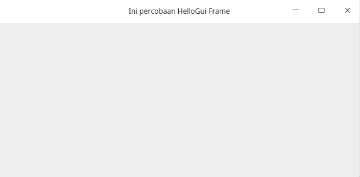
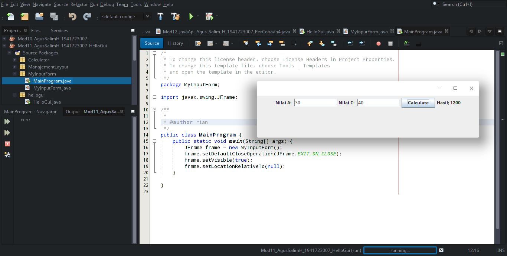
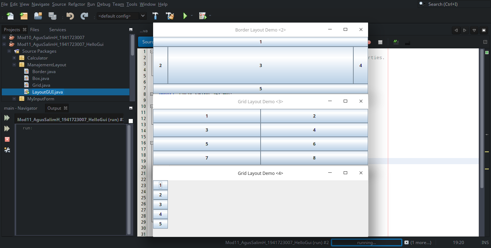
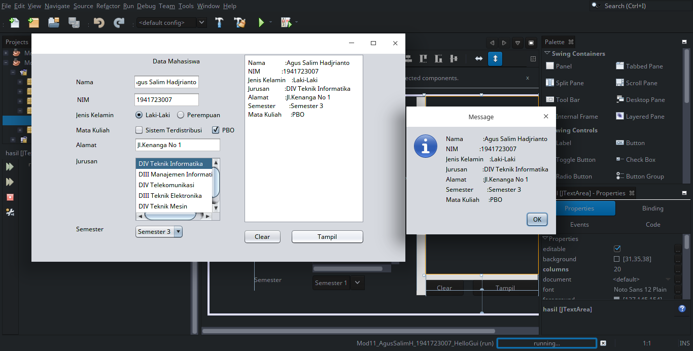
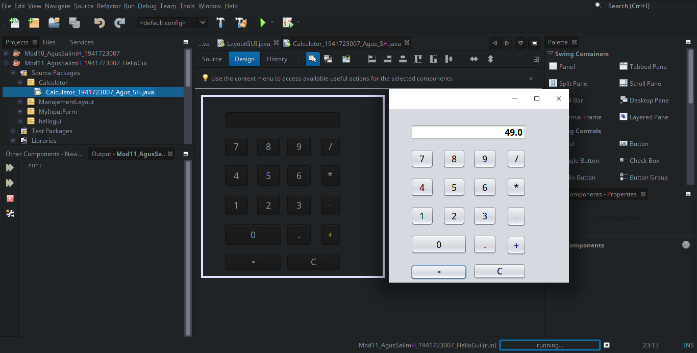

# Laporan 11_GUI

## Kompetensi

Setelah menyelesaikan lembar kerja ini mahasiswa diharapkan mampu:

1. Membuat aplikasi Graphical User Interface sederhana dengan bahasa pemrograman java;
2. Mengenal komponen GUI seperti frame, label, textfield, combobox, radiobutton, checkbox,
textarea, menu, serta table;
3. Menambahkan event handling pada aplikasi GUI 

## Ringkasan Materi

 GUI adalah sebuah interface antara user dengan program dengan tampilan grafis.
 Bagian dalam GUI ada 4 :

	1. Membuat windows utama
	2. Menentukan komponen-komponen pendukung program
	3. Menentukan tata letak layout agar nantinya semua komponen – komponen yang sudah
	dipersiapkan bisa diaatur sedemikian rupa
	4. Event Handling dari sebuah aktivitas, seperti penekanan button, check box dan lain-lain,
	Java Swing merupakan bagian dari JFC (Java Foundation Classes) yang menyediakan API untuk
	menangani hal yang berkaitan dengan GUI bagi program Java. Kita bisa membedakan komponen
	Swing dengan komponen AWT, di mana pada umumnya kelas-kelas yang berada dalam komponen
	Swing diawali dengan huruf J, misal: JButton, JLabel, JTextField, JRadioButton.

# Percobaan 1

1. Percobaan pada JFrame HelloGUI

[HelloGui](../../src/11_GUI/HelloGui_AgusSalimH_1941723007.java)

# Percobaan 2 

1. Percobaan pada input pada GUI

[MainProgram](../../src/11_GUI/MainProgram_AgusSalimH_1941723007.java)

[MyInputForm](../../src/11_GUI/MyInputForm1941723009Hafid.java)

## Pertanyaan

Modifikasi kode program dengan menambahkan JButton baru untuk melakukan fungsi
perhitungan penambahan, sehingga ketika button di klik (event click) maka akan
menampilkan hasil penambahan dari nilai A dan B

# Percobaan 3

1. Percobaan pada Manajemen Layout

[LayoutGUI](../../src/11_GUI/LayoutGUI_AgusSalimH_1941723007.java)

[Grid](../../src/11_GUI/Grid_AgusSalimH_1941723007.java)

[Box](../../src/11_GUI/Box_AgusSalimH_1941723007.java)

[Border](../../src/11_GUI/Border_AgusSalimH_1941723007.java)

## Pertanyaan

a) Apa perbedaan dari Grid Layout, Box Layout dan Border Layout?
b) Apakah fungsi dari masing-masing kode berikut?

### Jawab :
1. Grid layout mempunyai button 4 baris , Box mempunyai layout button beda bentuk bedaya pada interface output layout

2. fungsi dari masing masing kode berikut adalah instasiasi object jframe.

### Percobaan 4

[Swing](../../src/11_GUI/Swing_AgusSalimH_1941723007.java)

### Pertanyaan

1) Apakah fungsi dari kode berikut?
2) Mengapa pada bagian logika checkbox dan radio button digunakan multiple if ?
3) Lakukan modifikasi pada program untuk melakukan menambahkan inputan berupa alamat
dan berikan fungsi pemeriksaan pada nilai Alamat tersebut jika belum diisi dengan
menampilkan pesan peringatan?

### Jawab :
1. berfungsi untuk instansiasi Jframe dan Execute GUI
2. Karena jika if else maka akan di pilih salah satu

### Tugas

[Calculator](../../src/11_GUI/Calculator_1941723007_Agus_SH.java)

2. tampilan source code pada swing percobaan 5

## Kesimpulan

		Untuk membuat aplikasi Java berbasis GUI, kita butuh sebuah frame atau applet untuk media 
	eksekusi aplikasi GUI. Pada Java sebuah frame dapat diwakili oleh sebuah kelas, yaitu JFrame. 
	Melalui kelas JFrame kita bisa mendesain tampilan Java GUI sesuai kebutuhan. 

## Pernyataan Diri

	Saya menyatakan isi tugas, kode program, dan laporan praktikum ini dibuat oleh saya sendiri. Saya tidak melakukan plagiasi, kecurangan, menyalin/menggandakan milik orang lain.

	Jika saya melakukan plagiasi, kecurangan, atau melanggar hak kekayaan intelektual, saya siap untuk mendapat sanksi atau hukuman sesuai peraturan perundang-undangan yang berlaku.

	Ttd,

	(Agus Salim Hadjrianto)