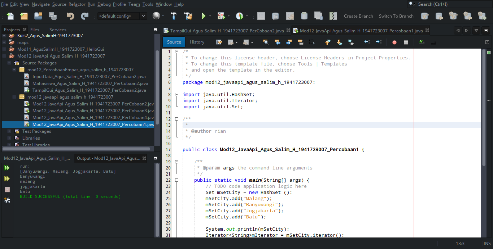
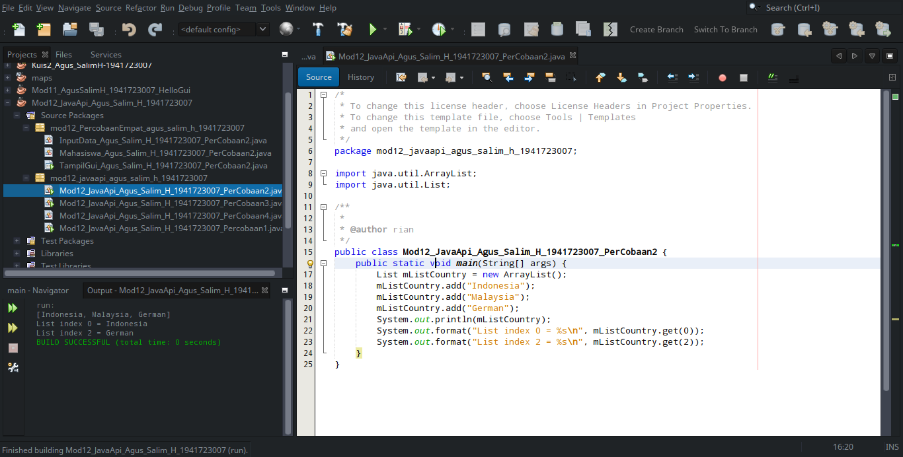
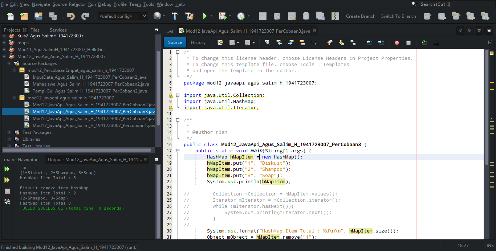
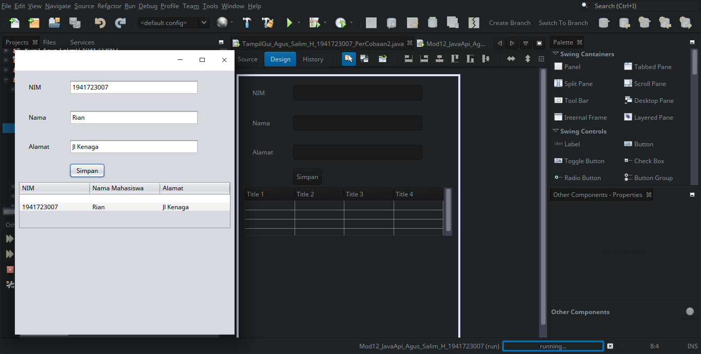

# Laporan #12 - Pengantar Konsep PBO

# Java_API_dan_Database

## Kompetensi

1. Tujuan Pembelajaran
 Memahami cara penyimpanan objek menggunakan Collection dan Map.
 Mengetahui pengelompokan dari Collection.
 Mengetahui perbedaan dari interface Set, List dan Map.
 Mengetahui penggunaan class-class dari interface Set, List, dan Map.
 Memahami koneksi database menggunakan JDBC dan JDBC API  

## Ringkasan Materi
Collection adalah suatu objek yang bisa digunakan untuk menyimpan sekumpulan objek.
Objek yang ada dalam Collection disebut elemen. Collection menyimpan elemen yang bertipe
Object, sehingga berbagai tipe object bisa disimpan dalam Collection.
Set mengikuti model himpunan, dimana objek/anggota yang tersimpan dalam Set harus
unik. Urutan maupun letak dari anggota tidak penting, hanya keberadaan anggota saja yang
penting. Kelas konkrit yang mengimplementasikan Set harus memastikan bahwa tidak terdapat
elemen duplikat yang dapat ditambahkan ke dalam set.
List digunakan untuk menyimpan sekumpulan objek berdasarkan urutan masuk (ordered)
dan menerima duplikat. Cara penyimpanannya seperti array, oleh sebab itu memiliki posisi
awal dan posisi akhir, menyisipkan objek pada posisi tertentu, mengakses dan menghapus isi
list, dimana semua proses ini selalu didasarkan pada urutannya.
ArrayList digunakan untuk membuat array yang ukurannya dinamis.
HashMap adalah class implementasi dar Map, Map itu sendiri adalah interface yang
memiliki fungsi untuk memetakan nilai dengan key unik.
HashMap berfungsi sebagai memory
record management, dimana setiap record dapat disimpan dalam sebuah Map.
JDBC API merupakan Java Database Connectivity Application Programming Interface (
JDBC API). Pada dasarnya JDBC API terdiri dari satu set kelas dan interface yang digunakan
untuk berinteraksi dengan database dari aplikasi Java.

## Percobaan

### Percobaan 1

link kode program : [link kode](../../src/12_Java_API/Mod12_JavaApi_Agus_Salim_H_1941723007_Percobaan1.java)

### Pertanyaan
1. Apakah fungsi import java.util.*; pada program diatas!

### jawab soal 1
fungsi import java.util.* adalah untuk memasukkan semua fungsi yang ada di dalam java.util

2. Pada baris program keberapakah yang berfungsi untuk menciptakan object HashSet?

### jawab soal 2
di project saya baris yang berfungsi untuk menciptakan object HashSet adalah pada baris ke 17 yang bertuliskan "Set mSetCity = new HashSet();"

3. Apakah fungsi potongan program dibawah ini pada percobaan 1! 

### jawab soal 3
potongan tersebut berfungsi untuk menambahan atau memasukkan nilai variabel

4. Tambahkan set.add(“Malang”); kemudian jalankan program! Amati hasilnya dan jelaskan
mengapa terjadi error!

### jawab soal 4
karena harus menambahkan fungsi didalam Set dengan fungsi import static java.lang.reflect.Array.set;

5. Jelaskan fungsi potongan program dibawah ini pada percobaan 1!

### jawab soal 5
fungsi potongan tersebut adalah untuk memfungsikan method dan menampilkan isi method

### Percobaan 2 

link kode program : [link kode](../../src/12_Java_API/Mod12_JavaApi_Agus_Salim_H_1941723007_PerCobaan2.java)

### Pertanyaan

1. Apakah fungsi potongan program dibawah ini!

### jawab soal 1
potongan program ini berfungsi untuk menampilkan array index ke 0 dan ke 2 yaitu indonesia dan german

2. Ganti potongan program pada soal no 1 menjadi sebagai berikut
Kemudian jalankan program tersebut!

### jawab soal 2

3. Jelaskan perbedaan menampilkan data pada ArrayList menggunakan potongan program pada
soal no 1 dan no 2!

### jawab soal 3
perbedaannya soal 1 dan 2 adalah pengurutan array pada index

### Percobaan 3

link kode program : [link kode](../../src/12_Java_API/Mod12_JavaApi_Agus_Salim_H_1941723007_PerCobaan3.java)

### Pertanyaan

1. Jelaskan fungsi hMapItem.put("1","Biskuit") pada program!

### jawab soal 1
berfungsi untuk meletakan nilai pada object hMapItem

2. Jelaskan fungsi hMapItem.size() pada program!

### jawab soal 2
berfungsi untuk menjumlahkan object yang ada pada HashMap

3. Jelaskan fungsi hMapItem.remove("1") pada program!

### jawab soal 3 
berfungsi untuk menghapus salah satu object dengan memasukan code nilai yang di hapus

4. Jelaskan fungsi hMapItem.clear() pada program!

### jawab soal 4
berfungsi untuk menghapus semua object yang ada di HashMap 

5. Tambahkan kode program yang di blok pada program yang sudah anda buat!

### jawab soal 5

6. Jalankan program dan amati apa yang terjadi!

### jawab soal 6

yang terjadi adalah keluarnya suatu nilai object secara berurutan sesuai kode nilai

7. Apakah perbedaan program sebelumnya dan setelah ditambahkan kode program pada soal no
5 diatas? Jelaskan

### jawab soal 7

sebelumnya object hanya mengisi nilai dengan mengurutkan secara manual
sedangkan soal no 5 mengurutkan nilai dengan fungi method next yang berfungsi untuk menampilkan object secara berurutkan sesuai nilai object yang di isi

### Percobaan 4

link kode program : [link kode](../../src/12_Java_API/Mahasiswa_Agus_Salim_H_1941723007_PerCobaan2.java)

### Percobaan 5

1. Buatlah Package baru dengan nama Biodata atau membuat project baru dengan cara
a. File  New Project
b. Pilih categories  Java dengan Projects  Java Application  klik next
c. Isi nama Project dengan Biodata dan atur letak project akan disimpan
d. Kemudian tambahkan Jframe Form dengan nama FormKoneksi.
e. Desain FormKoneksi seperti berikut2. Langkah selanjutnya tambahkan libraries, dengan cara klik kanan pada Libraries. Kemudian
pilih add library dan pilih MySQL JDBC Driver.
Tampilan Libraries setelah ditambah MySQL JDBC Driver.
3. Pada tahap ini aplikasi sudah siap untuk bertransaksi dengan database yang sudah kita buat
pada langkah 1. Selanjutnya kita buat method untuk melakukan koneksi dengan database,
seperti berikut:Pada method buka_koneksi untuk variabel url terdapat angka 6606 adalah port mysql yang
digunakan oleh penulis. Pada umumnya port mysql secara default adalah 3306. Sedangkan
untuk Biodata adalah nama database yang digunakan oleh penulis.
4. Pada button add klik tambahkan code sebagai berikut:
buka_koneksi();
String sqlkode="Insert into anggota (nama,alamat,telp) "
+ "values ('"+this.jTFNama.getText()+"',"
+ "'"+this.jTFAlamat.getText()+"',"
+ "'"+this.jTFTelepon.getText()+"')";
try {
PreparedStatement mStatement = koneksi.prepareStatement(sqlkode);
mStatement.executeUpdate();
mStatement.close();
JOptionPane.showMessageDialog(this,"Data Berhasil Ditambah");
} catch (SQLException ex) {
JOptionPane.showMessageDialog(this,"Terjadi Kesalahan "+ex.getMessage());
}
5. Setelah menambah code pada action button klik, coba jalankan program dan tambahkan
data. Apakah program berhasil menambahkan data? Jika tidak apakah penyebabnya.
.................................................................
6. Jelaskan maksud source code untuk melakukan insert data diatas?
.................................................................
7. Buat Table model yang digunakan untuk memanipulasi tampilan pada Jtable, seperti pada
code dibawah ini:8. Selanjutnya buat method ambil_data_tabel seperti berikut
private void ambil_data_tabel() {
model.getDataVector().removeAllElements();
model.fireTableDataChanged();
try {
buka_koneksi();
Statement s = koneksi.createStatement();
String sql = "Select * from anggota";
ResultSet r = s.executeQuery(sql);
while (r.next()) {
Object[] o = new Object[4];
o[0] = r.getString("id");
o[1] = r.getString("nama");
o[2] = r.getString("alamat");
o[3] = r.getString("telp");
model.addRow(o);
}
r.close();
s.close();
} catch (SQLException e) {
JOptionPane.showMessageDialog(this,"Terjadi kesalahan " + e.getMessage());
}
}
Jalankan program maka data yang sudah kita add akan tampil seperti berikut:9. Jelaskan alur dari method ambil_data_tabel?
...........
10. Buat fungsi untuk merefresh sehingga data yang baru dapat ditampilkan pada tabel.
2

## Kesimpulan

yang saya pelajari dari kumpulan percobaan pada minggu ke 12 java api dan database adalah mengisi, menghapus, memformat object dengan fungsi yang ada pada program HashMap, dan menambahkan data / menginput data menggunakan fungsi arraylist serta menampilkan di dalam komponen JFrame

## Pernyataan Diri

	Saya menyatakan isi tugas, kode program, dan laporan praktikum ini dibuat oleh saya sendiri. Saya tidak melakukan plagiasi, kecurangan, menyalin/menggandakan milik orang lain.

	Jika saya melakukan plagiasi, kecurangan, atau melanggar hak kekayaan intelektual, saya siap untuk mendapat sanksi atau hukuman sesuai peraturan perundang-undangan yang berlaku.

	Ttd,

	(Agus Salim Hadjrianto)