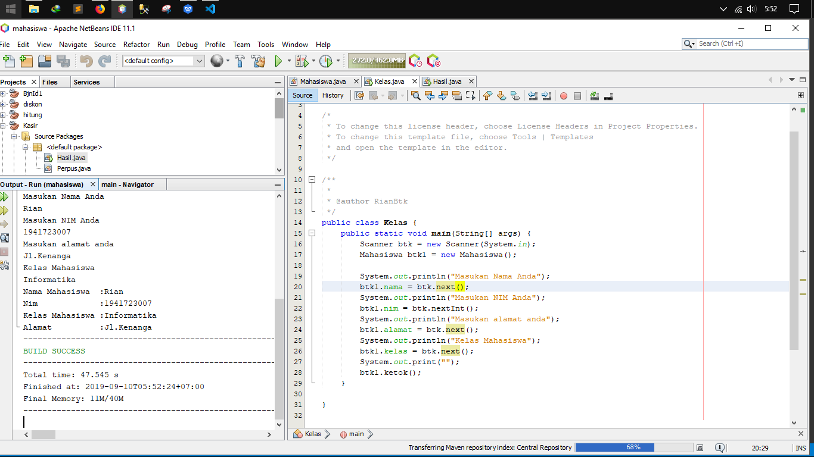
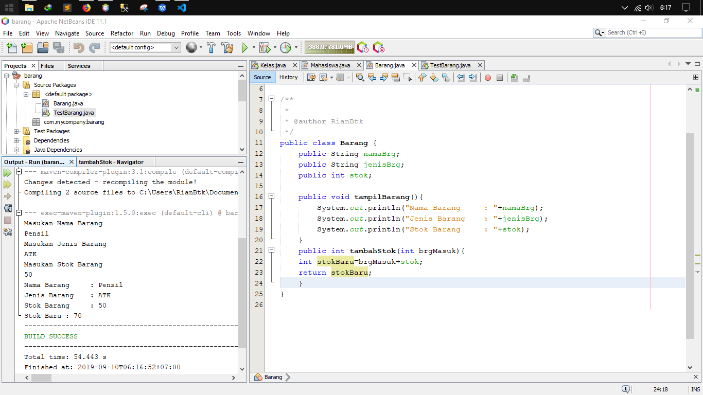
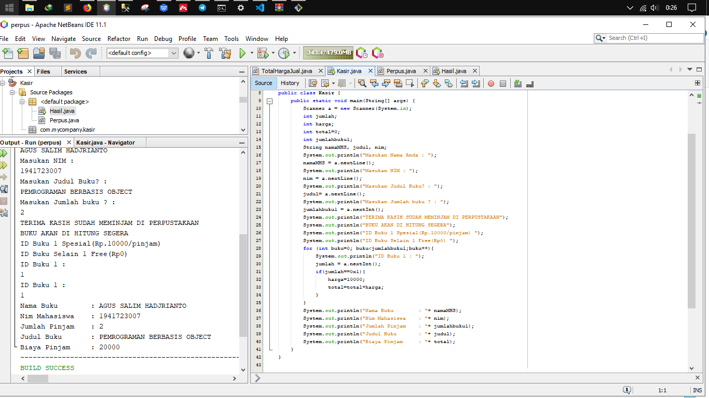
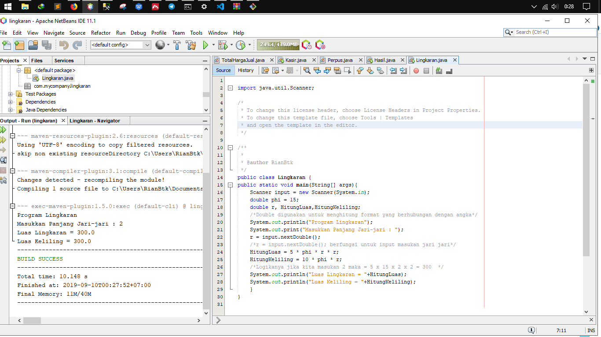
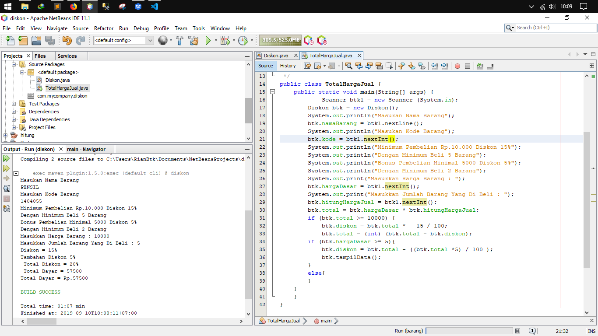

# Laporan Praktikum #1 - Pengantar Konsep PBO

## Kompetensi

* Mahasiswa dapat memahami deskripsi dari class dan object
* Mahasiswa memahami implementasi dari class
* Mahasiswa dapat memahami implementasi dari attribute
* Mahasiswa dapat memahami implementasi dari method
* Mahasiswa dapat memahami implementasi dari proses instansiasi
* Mahasiswa dapat memahami implementasi dari try-catch
* Mahasiswa dapat memahami proses pemodelan class diagram menggunakan UML

## Ringkasan Materi
* Ringkasan materi di sini kita belajar bagaimana cara menginstansiasi suatu class dengan class yang lain, dan juga kita belajar memanggil object dengan instansiasi, Seperti  2 kelas Barang dan TestBarang maka kita buat di TestBarang "Barang btk = new Barang();

## Percobaan

### Percobaan 1

* Percobaan satu : Membuat class Mahasiswa dan class Kelas Disini saya menggunakan instansisasi dari dua kelas dimana supaya dapat mecetak hasil secara langsung di output saya tambhakan Scanner supaya user mudah memasukan nilai sesui keinginanya tanpa harus bingun merubah Code 
` kelas Mahasiswa` 
 link kode program: [Program](../../src/2_Class_dan_Object/Mahasiswa.java)
link kode program : [Program](../../src/2_Class_dan_Object/Kelas.java)

### Percobaan 2

* Percobaan Dua : Membuat Class Barang dan TestBarang sama seperti di atas instansiasi juga perlu untuk menghubungkan object dan Class .
Dalam percobaan ini sama seperti di atas saya tambahkan Scanner untuk mempermudah user dalam memasukan objek sesuai keinginanya

 link kode program : [Program](../../src/2_Class_dan_Object/TestBarang.java)

## Pertanyaan

(silakan ketik pertanyaan di sini beserta jawabannya.)

## Tugas

1. Suatu toko persewaan video game salah satu yang diolah adalah peminjaman, dimana
data yang dicatat ketika ada orang yang melakukan peminjaman adalah id, nama 
member, nama game, dan harga yang harus dibayar. Setiap peminjaman bisa 
menampilkan data hasil peminjaman dan harga yang harus dibayar. Buatlah class 
diagram pada studi kasus diatas!
Penjelasan:

    * Harga yang harus dibayar diperoleh dari lama sewa x harga.
    * Diasumsikan 1x transaksi peminjaman game yang dipinjam hanya 1 game saja.

 program kasir dimana di dlamnya terdapat instansiasi Scanner "a.next..... yang berguna untuk setiap program yang belum di tampilkan user harus memasukanya dulu supaya dapat di tampilkan(flexsible)
 
 * 
2. Buatlah program dari class diagram yang sudah anda buat di no 1
kelas Mahasiswa

link kode program : [Program](../../src/2_Class_dan_Object/Kasir.java)

3. Program Hitung Jari-Jari linkaran
` hasil hitung jari jari Lingkaran dengan  jika kita masukan 2 maka = 5 x 15 x 2 x 2 = 300 `
* 

link kode program : [Program](../../src/2_Class_dan_Object/Lingkaran.java)

4. Program Pembayaran Dengan Diskon 
Pada program ini terdapat objek dan class seperti class Barang dan TestBarang dimana di dalamnya terdapat objek Barang meliputi kodeBarang, namaBarang, dan harga.

## Kesimpulan

* (Kesimpulanya kita di modul 2 di banyak memahami tentang kelas dan objek beserta atribut-atribut yang mendukung, selain itu kita juga dapat mempelajari tentang bagai mana cara yang tepat dalam penempatan kode serta kebutuhan user sehingga mereka mudah dalam mahami script)