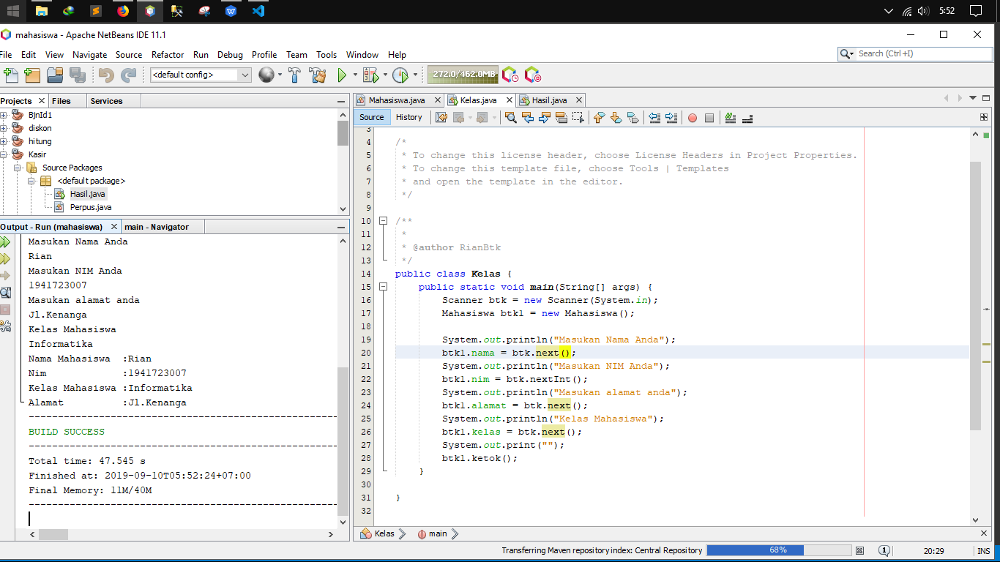
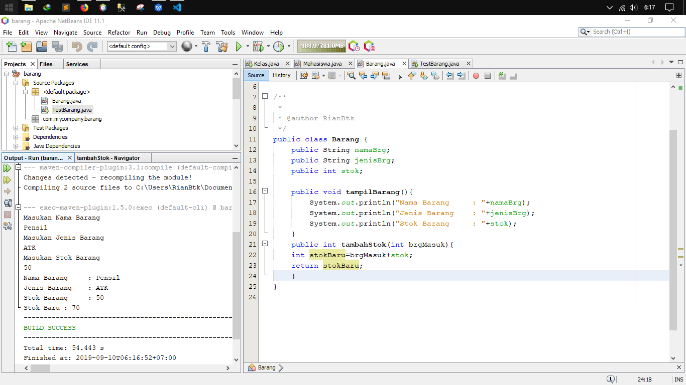
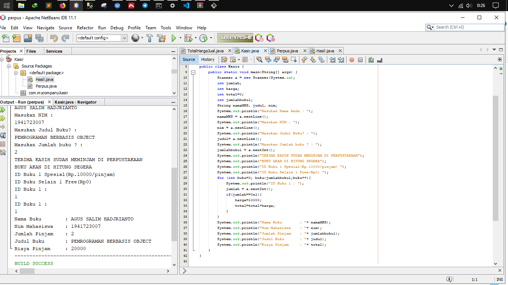
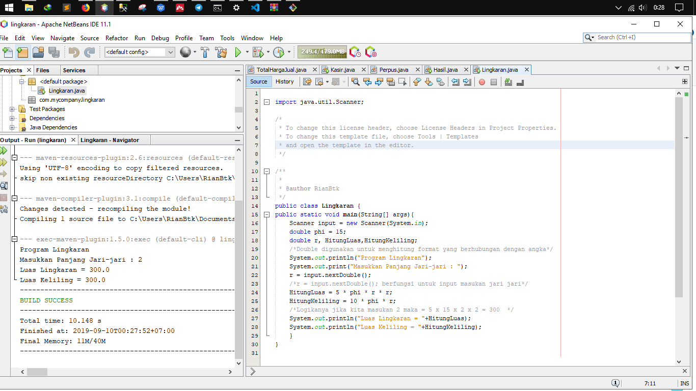

# Laporan Praktikum 2 - Pengantar Konsep PBO
## Nama : Agus Salim Hadjrianto              Nim : 1941723007
# PERCOBAAN
1. Percobaan satu : Membuat class Mahasiswa dan class Kelas Disini saya menggunakan instansisasi dari dua kelas dimana supaya dapat mecetak hasil secara langsung di output saya tambhakan Scanner supaya user mudah memasukan nilai sesui keinginanya tanpa harus bingun merubah Code
`contoh kelas Mahasiswa` 
Contoh link kode program satu : [ini contoh link ke kode program](src\2_Class_dan_Object\Mahasiswa.java)
Contoh link kode program dua : [ini contoh link ke kode program](src\2_Class_dan_Object\Kelas.java)
2. Percobaan Dua : Membuat Class Barang dan TestBarang sama seperti di atas instansiasi juga perlu untuk menghubungkan object dan Class .
Dalam percobaan ini sama seperti di atas saya tambahkan Scanner untuk mempermudah user dalam memasukan objek sesuai keinginanya
`Contoh kelas Barang` 
`contoh kelas Mahasiswa` 
Contoh link kode program satu : [ini contoh link ke kode program](src\2_Class_dan_Object\Barang.java)
Contoh link kode program dua : [ini contoh link ke kode program](src\2_Class_dan_Object\TestBarang.java)
# TUGAS
1. Suatu toko persewaan video game salah satu yang diolah adalah peminjaman, dimana
data yang dicatat ketika ada orang yang melakukan peminjaman adalah id, nama 
member, nama game, dan harga yang harus dibayar. Setiap peminjaman bisa 
menampilkan data hasil peminjaman dan harga yang harus dibayar. Buatlah class 
diagram pada studi kasus diatas!
Penjelasan:
a. Harga yang harus dibayar diperoleh dari lama sewa x harga.
b. Diasumsikan 1x transaksi peminjaman game yang dipinjam hanya 1 game saja.
2. Buatlah program dari class diagram yang sudah anda buat di no 1
`Contoh program kasir dimana di dlamnya terdapat instansiasi Scanner "a.next..... yang berguna untuk setiap program yang belum di tampilkan user harus memasukanya dulu supaya dapat di tampilkan(flexsible)`

`contoh kelas Mahasiswa` 
Contoh link kode program satu : [ini contoh link ke kode program](src\2_Class_dan_Object\Kasir.java)

3. Program Hitung Jari-Jari linkaran
`Contoh hasil hitung jari jari Lingkaran dengan contoh jika kita masukan 2 maka = 5 x 15 x 2 x 2 = 300 `

`contoh kelas Mahasiswa` 
Contoh link kode program satu : [ini contoh link ke kode program](src\2_Class_dan_Object\Lingkaran.java)

4. Program Pembayaran Dengan Diskon 
Pada program ini terdapat objek dan class seperti class Barang dan TestBarang dimana di dalamnya terdapat objek Barang meliputi kodeBarang, namaBarang, dan harga.
`Berikut Contoh Programnya` 

## Pernyataan Diri

Saya menyatakan isi tugas, kode program, dan laporan praktikum ini dibuat oleh saya sendiri. Saya tidak melakukan plagiasi, kecurangan, menyalin/menggandakan milik orang lain.

Jika saya melakukan plagiasi, kecurangan, atau melanggar hak kekayaan intelektual, saya siap untuk mendapat sanksi atau hukuman sesuai peraturan perundang-undangan yang berlaku.

Ttd,

***(Agus Salim Hadjrianto)***
