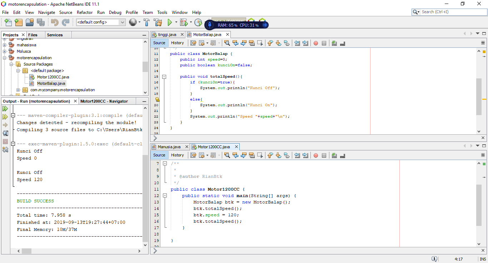
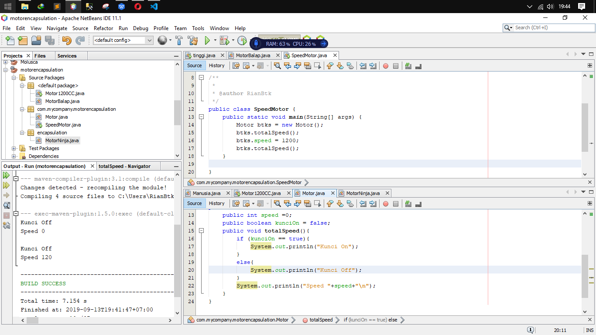
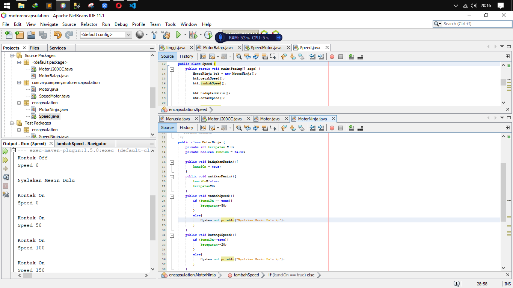
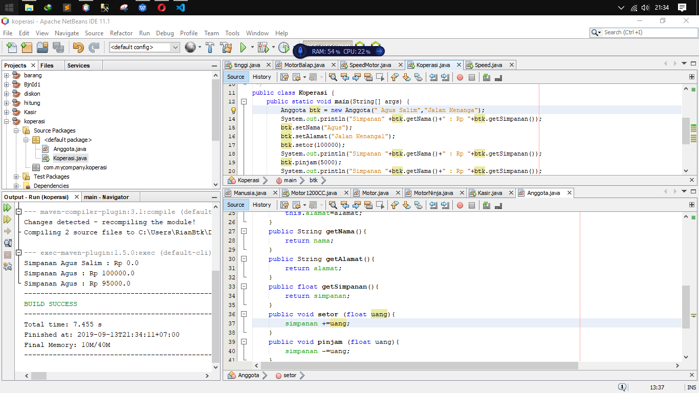
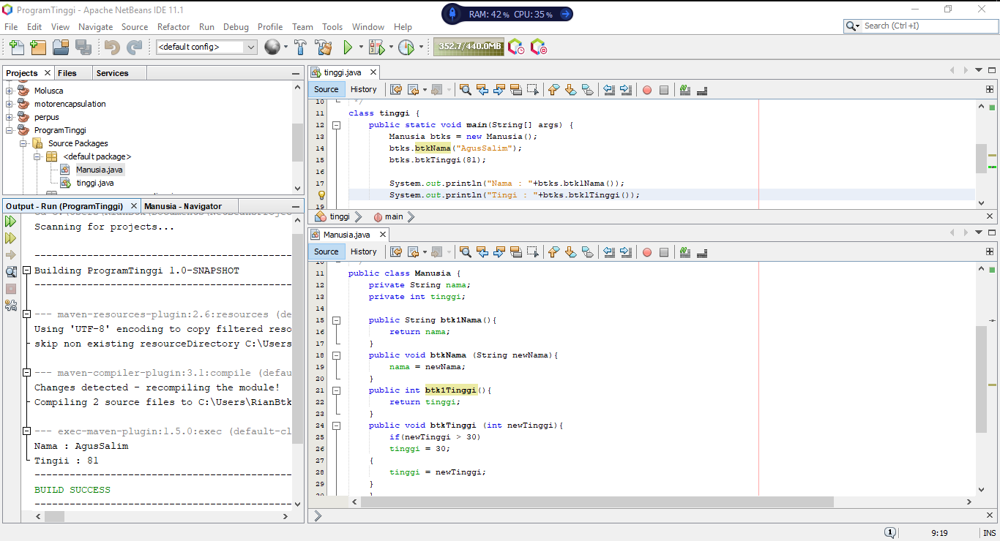
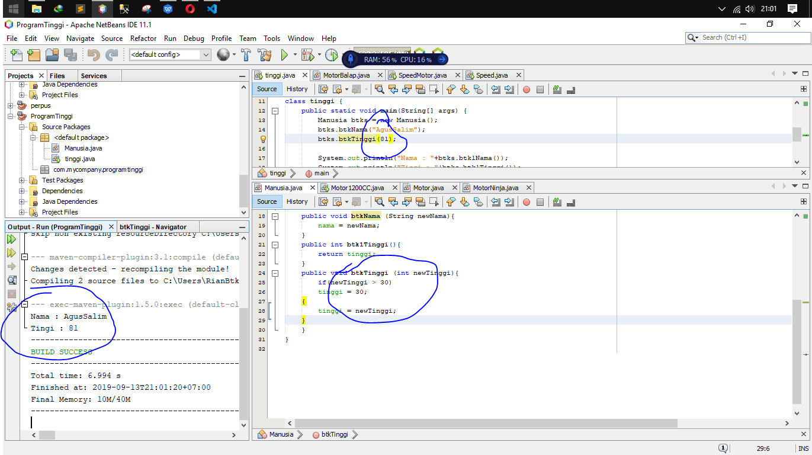
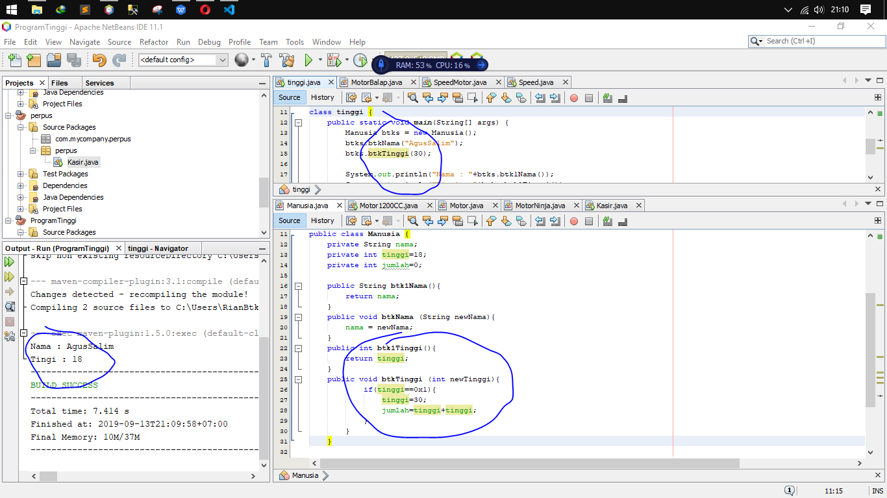
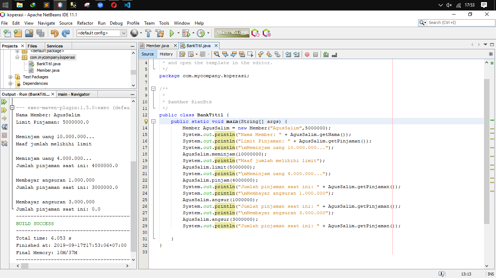
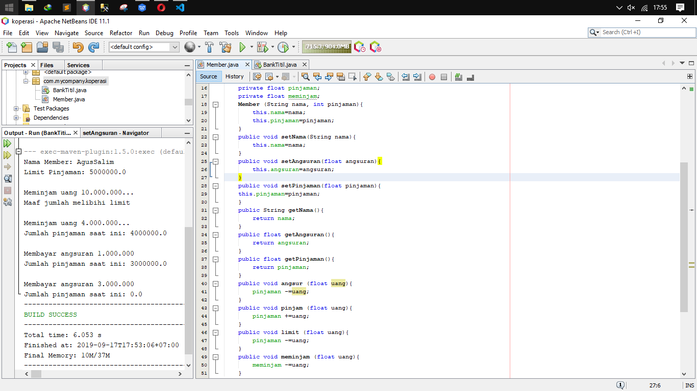

# Laporan Praktikum 3 - Enkapsulasi

## Kompetensi

Setelah melakukan percobaan pada modul ini, mahasiswa memahami konsep:

1. Konstruktor
2. Akses Modifier
3. Atribut/method pada class
4. Intansiasi atribut/method 
5. Setter dan getter
6. Memahami notasi pada UML Class Diagram

## Ringkasan Materi

    Ringkasan Materi pada modul tiga dijalaskan bahwa : 
    Encaptulation adalah Proses Encapsulation di mana kita tahu bahwa contoh :
    - Kita Mengetik di Laptop kita tahunya ada interface yang keluar di layar tapi kita tidak tahu proses apa yang di lalui sehingga ada interface di layar.

    Konstruktor ialah Kontruksi dari sebuah program dimana konstruktor dapat memudahkan programing dalam mendesain sebuah program karena telah terkontruksi
    - Contoh : Kita Desain Sepedah motor kita tau sepdah motor buth fairing butuh kerangka dan butuh mesin tapi kita dan hasilnya sepdah terlihat bagus tapi kalau sudah terlihat bagus apakah bisa berjalan ? kan tidak masih butuh banyak lagi untuk sampai bisa digunakan.

    Modifield digunakan untuk menentukan relasi antar klas atau private class.
    - Contoh Public dia bisa di akses oleh  class lainya

    Private bisa di akses oleh satu class dan bisa juga clas lain dengan instansiasi,
    default hanya dapat diakses di dalam package yang sama

    protected dapat diakases di luar package menggunakan subclass

## Percobaan

### Percobaan 1

Percobaan satu : Disini terdapat hasil gandjil karena pada public bolean dikatan false dan di program kurang di tambahkan argument yang menyatakan bahwa speed on harus 100 sehingga output yang keluar terpaku pada claas dua yang menyatakan total Speednya.
`PERCOBAAN SATU` 
 link kode program: [Program Satu](../../src/3_Enkapsulasi/MotorBalap.java)
 link kode program: [Program Dua](../../src/3_Enkapsulasi/Motor1200CC.java) 

### Percobaan 2

Percobaan Dua : Dalam Pecobaan dua hasilnya masih sama dengan percobaan pertama karena belum ada deklarasi yang menyatakan speed on kecepatan berapa dan speed off kecepatan berapa dan kecepatan itu statusnya apa.

 link kode program: [Program Satu](../../src/3_Enkapsulasi/Motor.java)
 link kode program: [Program Dua](../../src/3_Enkapsulasi/SpeedMotor.java)

### Percobaan 3
Percobaan 3 : Dalam percobaan tiga baru bena ketika kunci off maka kecepatanya 0 dan jika mesinya di nyalakan maka kecepatanya akan di tambahkan 50 sesuai berapa ditambahkanya tambahSpeed, jika di ulang 10 kali maka speed akan ditambah 50 + 10 perulangan = 50 x 10 = 500

 link kode program: [Program Satu](../../src/3_Enkapsulasi/Speed.java)
 link kode program: [Program Dua](../../src/3_Enkapsulasi/MotorNinja.java)
 ### Percobaan 4
Percobaan 4 : Dalam percobaan empat disini kita mencoba membuat program koperasi dimana pada program ini saya menyetor uang sejumlah 100 ribu dan saya meminjamnya kembali 5000 jadi saldo saya ringgal 95 ribu
 
 link kode program: [Program Satu](../../src/3_Enkapsulasi/Anggota.java)
 link kode program: [Program Dua](../../src/3_Enkapsulasi/Koperasi.java)
## Pertanyaan

1. Apa yang dimaksud getter dan setter?
* Jawab : Getter dan Setter ialah method modifier public jika setter tidak memiliki nilai kembalian disini getter yang mempunyai kambalian nilai Gampangnya Setter untuk menSet sebuah nilaiVoid kalu getter untuk menarik nilaiVoid.
2. Apa kegunaan dari method getSimpanan()?
* Jawab kegunaanya untuk mengambil nilai dari void class utama .Contoh Class Laptop ingin menampilkan outputnya maka klass VarianLaptop harus menarik dulu menggunakan method tampilVarian();
3. Method apa yang digunakan untk menambah saldo?
* Jawab : method setor
4. Apa yand dimaksud konstruktor?
* Jawab : Konstruktor adalah tahapan perancangan dimana ada method ada class ada system tetap belum sampai tahap output rincinya.
5. Sebutkan aturan dalam membuat konstruktor?
* Jawab : konstructor digunakan untuk menyiapkan data untuk class. aturanya dengan menambah parameter pada variabel
6. Apakah boleh konstruktor bertipe private?
* Jawab : Boleh Karena dalam konstruksi variable class tergantung kebutuhan user saat ingin menggunakan tipe private,public dll, intinya sesuai kebutuhanya.
7. Kapan menggunakan parameter dengan passsing parameter?
* Jawab : saat instansiasi object. Class a = new Class();
a.Atribut / a.Method
8. Apa perbedaan atribut class dan instansiasi atribut?
* Jawab : Bedanya kalau atribut itu atribut kalau instansiasi atribut itu pemanngilan atribut dengan instansiasi a.Atribut
9. Apa perbedaan class method dan instansiasi method?
* Jawab : method getHasi() kalau instansiasi method a.getHasil()

## Tugas

1. Program perhitungan tinggi badan disini terdapat atribut nama,tinggi dan instansiasi dari calss tinggi ke class manusia

 link kode program: [Program Satu](../../src/3_Enkapsulasi/Manusia.java)
 link kode program: [Program Dua](../../src/3_Enkapsulasi/tinggi.java)
2. Karena dalam class manusia tidak di tampulkan system output dan di class tinggi di tampilkan maka yang tampil adalah nilai yang ada di dalam class tinggi = 81

3. perbedaanya dengan nomor dua di sini dalam perulangan if saya tambahkan variabel if(tinggi==0x1){tinggi=30;jumlah=tinggi+tinggi;} dan pada tinggi saya batasi dengan tinggi=18;

4. Program Pinjaman Dan Angsuran
Agus salim pinjam uang 10 juta dengan limit pinjaman 5 juta = pinjam 4 juta lalu mengangsur 1 juta lalu angsur lagi 3 juta = 4Juta-1Juta = 3Juta | 3Juta-3Juta=0 Jadi sekarang Agus Tidak punya Hutang

 link kode program: [Program Satu](../../src/3_Enkapsulasi/Member.java)
 link kode program: [Program Dua](../../src/3_Enkapsulasi/BankTitil.java)

## Kesimpulan

* (Kesimpulanya di modul 3 kita belajar mengenai konsep serta relasi antar class dengan cara Enkapsulasi,Konstruktor,Dan Modifield dimana semua saling berkaitan dalam tujuan pengembangan suatu program object)