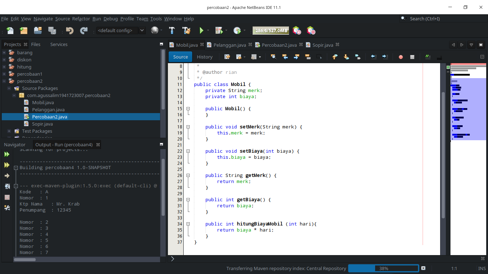

# Laporan Praktikum 4 - Pengantar Konsep PBO

## Kompetensi

Setelah menempuh pokok bahasan ini, mahasiswa mampu:
1. Memahami konsep relasi kelas;
2. Mengimplementasikan relasi has‑a dalam program

## Ringkasan Materi

## Percobaan 1

Percobaan satu : 

`PERCOBAAN SATU` 

`PROCESSOR` 

`LAPTOP` 

 link kode program: [Program 1](../../src/4_Relasi_Class/Percobaan1.java) [Program 2](../../src/4_Relasi_Class/Processor.java) [Program 3](../../src/4_Relasi_Class/Laptop.java)

### Pertanyaan Percobaan 1

Berdasarkan percobaan 1, jawablah pertanyaan‑pertanyaan yang terkait:

1. Di dalam class Processor dan class Laptop , terdapat method setter dan getter untuk 
masing‑masing atributnya. Apakah gunanya method setter dan getter tersebut ?
2. Di dalam class Processor dan class Laptop, masing‑masing terdapat konstruktor 
default dan konstruktor berparameter. Bagaimanakah beda penggunaan dari kedua jenis 
konstruktor tersebut ?
3. Perhatikan class Laptop, di antara 2 atribut yang dimiliki (merk dan proc), atribut 
manakah yang bertipe object ?
4. Perhatikan class Laptop, pada baris manakah yang menunjukan bahwa class Laptop
memiliki relasi dengan class Processor ?
5. Perhatikan pada class Laptop , Apakah guna dari sintaks proc.info() ?
6. Pada class MainPercobaan1, terdapat baris kode:
Laptop l = new Laptop("Thinkpad", p);.
Apakah p tersebut ?
Dan apakah yang terjadi jika baris kode tersebut diubah menjadi:
Laptop l = new Laptop("Thinkpad", new Processor("Intel i5", 
3));
Bagaimanakah hasil program saat dijalankan, apakah ada perubahan ?

### Percobaan 2

Percobaan Dua :

`PERCOBAAN DUA` 

`Pelanggan` 

`Sopir` 

`Mobil` 

 link kode program: [Program 1, ](../../src/4_Relasi_Class/Percobaan2.java) [Program 2, ](../../src/4_Relasi_Class/Pelanggan.java) [Program 3, ](../../src/4_Relasi_Class/Sopir.java) [Program 4, ](../../src/4_Relasi_Class/Mobil.java)

## Pertanyaan Percobaan 2

1. Perhatikan class Pelanggan. Pada baris program manakah yang menunjukan bahwa class
Pelanggan memiliki relasi dengan class Mobil dan class Sopir ?
2. Perhatikan method hitungBiayaSopir pada class Sopir, serta method 
hitungBiayaMobil pada class Mobil. Mengapa menurut Anda method tersebut harus 
memiliki argument hari ?
3. Perhatikan kode dari class Pelanggan. Untuk apakah perintah
mobil.hitungBiayaMobil(hari) dan sopir.hitungBiayaSopir(hari) ?
4. Perhatikan class MainPercobaan2. Untuk apakah sintaks p.setMobil(m) dan
p.setSopir(s) ?
5. Perhatikan class MainPercobaan2. Untuk apakah proses p.hitungBiayaTotal()
tersebut ?
6. Perhatikan class MainPercobaan2, coba tambahkan pada baris terakhir dari method
main dan amati perubahan saat di‑run!
System.out.println(p.getMobil().getMerk());
Jadi untuk apakah sintaks p.getMobil().getMerk() yang ada di dalam method 
main tersebut?

### Percobaan 3
Percobaan 3 : 
`PERCOBAAN TIGA` 

`KeretaApi` 

`Pegawai` 

 link kode program: [Program 1, ](../../src/4_Relasi_Class/Percobaan3.java) [Program 2, ](../../src/4_Relasi_Class/KeretaApi.java) [Program 3, ](../../src/4_Relasi_Class/Pegawai.java)

## Pertanyaan Percobaan 4

1. Di dalam method info() pada class KeretaApi, baris this.masinis.info() dan
this.asisten.info() digunakan untuk apa ?
2. Buatlah main program baru dengan nama class MainPertanyaan pada package yang 
sama. Tambahkan kode berikut pada method main() !
Pegawai masinis = new Pegawai("1234", "Spongebob 
Squarepants");
KeretaApi keretaApi = new KeretaApi("Gaya Baru", "Bisnis", 
masinis);
System.out.println(keretaApi.info());
3. Apa hasil output dari main program tersebut ? Mengapa hal tersebut dapat terjadi ?
4. Perbaiki class KeretaApi sehingga program dapat berjalan !
 ### Percobaan 4
Percobaan 4 : 

`PERCOBAAN EMPAT` 

`Pelanggan` 

`Sopir` 

`Mobil` 

 link kode program: [Program 1, ](../../src/4_Relasi_Class/Percobaan2.java) [Program 2, ](../../src/4_Relasi_Class/Pelanggan.java) [Program 3, ](../../src/4_Relasi_Class/Sopir.java) [Program 4, ](../../src/4_Relasi_Class/Mobil.java)

## Pertanyaan Percobaan 4
1. Pada main program dalam class MainPercobaan4, berapakah jumlah kursi dalam 
Gerbong A ?
2. Perhatikan potongan kode pada method info() dalam class Kursi. Apa maksud kode 
tersebut ?
...
if (this.penumpang != null) {
info += "Penumpang: " + penumpang.info() + "\n";
}
...
3. Mengapa pada method setPenumpang() dalam class Gerbong, nilai nomor dikurangi 
dengan angka 1 ?
4. Instansiasi objek baru budi dengan tipe Penumpang, kemudian masukkan objek baru 
tersebut pada gerbong dengan gerbong.setPenumpang(budi, 1). Apakah yang 
terjadi ?
5. Modifikasi program sehingga tidak diperkenankan untuk menduduki kursi yang sudah ada 
penumpang lain !

## Tugas

* Buatlah sebuah studi kasus, rancang dengan class diagram, kemudian implementasikan ke dalam 
program! Studi kasus harus mewakili relasi class dari percobaan‑percobaan yang telah dilakukan 
pada materi ini, setidaknya melibatkan minimal 4 class (class yang berisi main tidak dihitung)

## Kesimpulan
