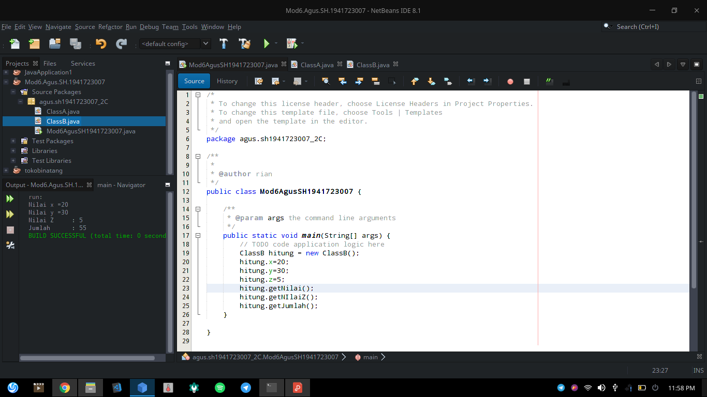
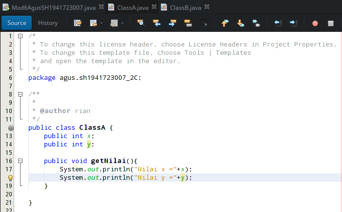
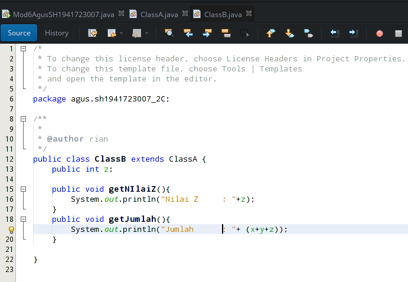
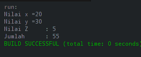
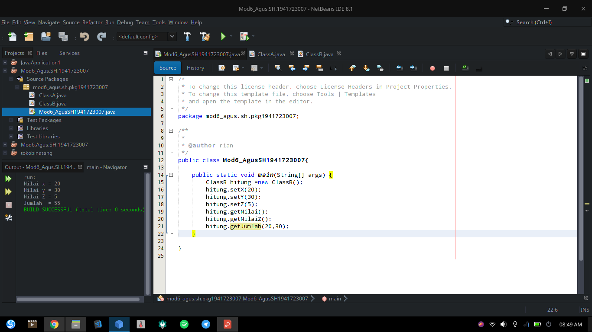
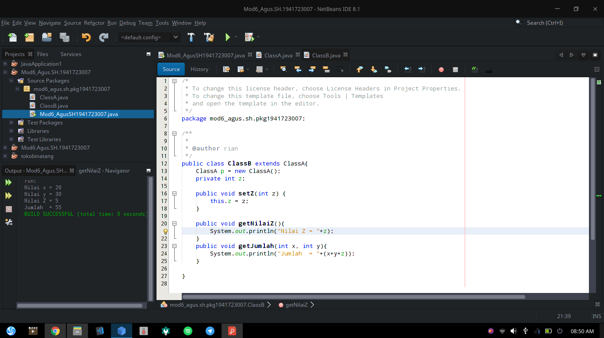
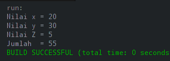

# Laporan Praktikum 6 - Inheritance

## Kompetensi

1. Memahami	konsep	dasar	inheritance	atau	pewarisan.
2. Mampu	membuat	suatu	subclass	dari	suatu	superclass	tertentu.
3. Mampu	mengimplementasikan	konsep	single	dan	multilevel	inheritance.
4. Mampu	membuat	objek	dari	suatu	subclass	dan	melakukan	pengaksesan	terhadap	atribut	
dan	method	baik	yang	dimiliki	sendiri	atau	turunan	dari	superclass	nya.

## Ringkasan Materi

## Percobaan 1

Percobaan satu : 

`PERCOBAAN SATU` 

`Class A` 

`Class B` 

 <!-- link kode program: [Program 1](../../src/4_Relasi_Class/Percobaan1.java) [Program 2](../../src/4_Relasi_Class/Processor.java) [Program 3](../../src/4_Relasi_Class/Laptop.java) -->

### Pertanyaan Percobaan 1

1. Pada	percobaan	1	diatas	program	yang	dijalankan	terjadi	error,	kemudian	perbaiki	sehingga	
program	tersebut	bisa	dijalankan	dan	tidak	error!

    Eror karena ("Jumlah      : "+ (x+y+z)); x+y ada di ClassA

    Dan harus di extends ke ClassA

    public class ClassB extends ke ClassA

2. Jelaskan	apa	penyebab	program pada	percobaan	1	ketika	dijalankan	terdapat	error!

    Penyebabnya karena x+y tidak extends ke ClassA

### Percobaan 2

Percobaan Dua :

`PERCOBAAN DUA` 

`Class A` 

`Class B` 

## Pertanyaan Percobaan 2

1. Pada	percobaan	2 diatas	program	yang	dijalankan	terjadi	error,	kemudian	perbaiki	sehingga	
program	tersebut	bisa	dijalankan	dan	tidak	error!

    ClassB extends ClassA

    public void getJumlah(int x, int y)

    hitung.getJumlah(20,30);

2. Jelaskan	apa	penyebab	program	pada	percobaan	1	ketika	dijalankan	terdapat	error!

    Karena ClassB tidak extends ke ClassA dan pada Instansiasi hitung.getJumlah kurang parameter int x dan int y

