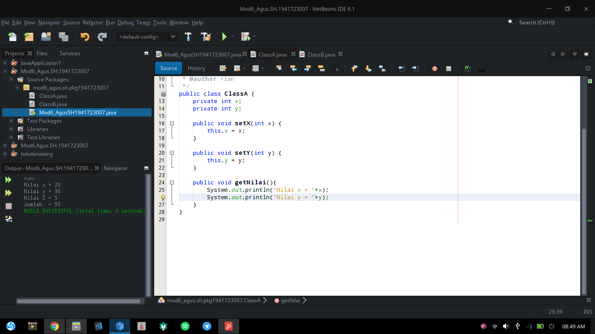

# Laporan Praktikum 6 - Inheritance

## Kompetensi

1. Memahami	konsep	dasar	inheritance	atau	pewarisan.
2. Mampu	membuat	suatu	subclass	dari	suatu	superclass	tertentu.
3. Mampu	mengimplementasikan	konsep	single	dan	multilevel	inheritance.
4. Mampu	membuat	objek	dari	suatu	subclass	dan	melakukan	pengaksesan	terhadap	atribut	
dan	method	baik	yang	dimiliki	sendiri	atau	turunan	dari	superclass	nya.

## Ringkasan Materi

## Percobaan 1

Percobaan satu : 

`PERCOBAAN SATU` 

`Class A` 

`Class B` 

 <!-- link kode program: [Program 1](../../src/4_Relasi_Class/Percobaan1.java) [Program 2](../../src/4_Relasi_Class/Processor.java) [Program 3](../../src/4_Relasi_Class/Laptop.java) -->

### Pertanyaan Percobaan 1

1. Pada	percobaan	1	diatas	program	yang	dijalankan	terjadi	error,	kemudian	perbaiki	sehingga	
program	tersebut	bisa	dijalankan	dan	tidak	error!

    Eror karena ("Jumlah      : "+ (x+y+z)); x+y ada di ClassA

    Dan harus di extends ke ClassA

    public class ClassB extends ke ClassA

2. Jelaskan	apa	penyebab	program pada	percobaan	1	ketika	dijalankan	terdapat	error!

    Penyebabnya karena x+y tidak extends ke ClassA

### Percobaan 2

Percobaan Dua :

`PERCOBAAN DUA` 

`Class A` 

`Class B` 

## Pertanyaan Percobaan 2

1. Pada	percobaan	2 diatas	program	yang	dijalankan	terjadi	error,	kemudian	perbaiki	sehingga	
program	tersebut	bisa	dijalankan	dan	tidak	error!

    ClassB extends ClassA

    public void getJumlah(int x, int y)

    hitung.getJumlah(20,30);

2. Jelaskan	apa	penyebab	program	pada	percobaan	1	ketika	dijalankan	terdapat	error!

    Karena ClassB tidak extends ke ClassA dan pada Instansiasi hitung.getJumlah kurang parameter int x dan int y

### Percobaan 3
Percobaan 3 : 
`PERCOBAAN TIGA` 

`KeretaApi` 

`Pegawai` 

 link kode program: [Program 1, ](../../src/4_Relasi_Class/Percobaan3.java) [Program 2, ](../../src/4_Relasi_Class/KeretaApi.java) [Program 3, ](../../src/4_Relasi_Class/Pegawai.java)

## Pertanyaan Percobaan 4

1. Di dalam method info() pada class KeretaApi, baris this.masinis.info() dan
this.asisten.info() digunakan untuk apa ?
2. Buatlah main program baru dengan nama class MainPertanyaan pada package yang 
sama. Tambahkan kode berikut pada method main() !
Pegawai masinis = new Pegawai("1234", "Spongebob 
Squarepants");
KeretaApi keretaApi = new KeretaApi("Gaya Baru", "Bisnis", 
masinis);
System.out.println(keretaApi.info());
3. Apa hasil output dari main program tersebut ? Mengapa hal tersebut dapat terjadi ?
4. Perbaiki class KeretaApi sehingga program dapat berjalan !
 ### Percobaan 4
Percobaan 4 : 

`PERCOBAAN EMPAT` 

`Pelanggan` 

`Sopir` 

`Mobil` 

 link kode program: [Program 1, ](../../src/4_Relasi_Class/Percobaan2.java) [Program 2, ](../../src/4_Relasi_Class/Pelanggan.java) [Program 3, ](../../src/4_Relasi_Class/Sopir.java) [Program 4, ](../../src/4_Relasi_Class/Mobil.java)

## Pertanyaan Percobaan 4
1. Pada main program dalam class MainPercobaan4, berapakah jumlah kursi dalam 
Gerbong A ?
2. Perhatikan potongan kode pada method info() dalam class Kursi. Apa maksud kode 
tersebut ?
...
if (this.penumpang != null) {
info += "Penumpang: " + penumpang.info() + "\n";
}
...
3. Mengapa pada method setPenumpang() dalam class Gerbong, nilai nomor dikurangi 
dengan angka 1 ?
4. Instansiasi objek baru budi dengan tipe Penumpang, kemudian masukkan objek baru 
tersebut pada gerbong dengan gerbong.setPenumpang(budi, 1). Apakah yang 
terjadi ?
5. Modifikasi program sehingga tidak diperkenankan untuk menduduki kursi yang sudah ada 
penumpang lain !

## Tugas

* Buatlah sebuah studi kasus, rancang dengan class diagram, kemudian implementasikan ke dalam 
program! Studi kasus harus mewakili relasi class dari percobaan‑percobaan yang telah dilakukan 
pada materi ini, setidaknya melibatkan minimal 4 class (class yang berisi main tidak dihitung)

## Kesimpulan
