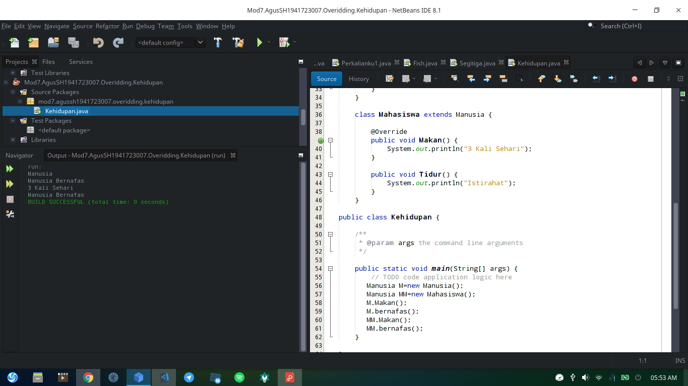

# Laporan Praktikum 7 Overriding_dan_Overloading

## Kompetensi
# Setelah menempuh pokok bahasan ini, mahasiswa mampu :
    a. Memahami konsep overloading dan overriding,
    b. Memahami perbedaan overloading dan overriding,
    c. Ketepatan dalam mengidentifikasi method overriding dan overloading
    d. Ketepatan dalam mempraktekkan instruksi pada jobsheet
    e. Mengimplementasikan method overloading dan overriding.

# ## Ringkasan Materi
    * Overloading 
    adalah menuliskan kembali method dengan nama yang sama pada suatu class. Tujuannya 
    dapat memudahkan penggunaan/pemanggilan method dengan fungsionalitas yang mirip namun beda parameter
    Jadi dalam overloading sama method atau void tidak masalah tapi tidak sama ti parameter sehingga data bisa di proses,
    * Overriding
    adalah Sublass yang berusaha memodifkasi tingkah laku yang diwarisi dari superclass. 
    Tujuannya subclass dapat memiliki tingkah laku yang lebih spesifik sehingga dapat 
    dilakukan dengan cara mendeklarasikan kembali method milik parent class di subclass.
    Deklarasi method pada subclass harus sama dengan yang terdapat di super class. 

# Percobaan 1
    Percobaan satu : 

]

 link kode program: 
 [Karyawan, |](../../src/7_Overriding_dan_Overloading/Karyawan.java) [Manager, |](../../src/7_Overriding_dan_Overloading/Manager.java) 
 [Staff, |](../../src/7_Overriding_dan_Overloading/Staff.java)
 [MainClass.](../../src/7_Overriding_dan_Overloading/MainClassKMS.java)

 # Latihan
    Latihan : 

 

 link kode program: 
 [Perkalianku](../../src/7_Overriding_dan_Overloading/Perkalianku.java)

    Soal
    1. Terletak di void perkalian tapi beda di parameternya
    2. 1 parameter (c).
        void 1 (a*b)
        void 2 (a*b*c)

 

 link kode program: 
 [Perkalianku](../../src/7_Overriding_dan_Overloading/Perkalianku1.java)

    Soal
    1. void perkalian
    2. Dua parameter 1 menggunakan float dan parameter dua menggunakan double perbedaanya di float dan double

 

 link kode program: 
 [Fish](../../src/7_Overriding_dan_Overloading/Fish.java)

    Soal
    1. terletak di class Ikan dan Piranha
    2. class ikan dan piranha berada di atas public class jadi bisa di overrid ke public class fish dengan note class extends class public class call class

# Tugas
 1. Overloading

 
 

 link kode program: 
 [Overloading](../../src/7_Overriding_dan_Overloading/Segitiga.java)

 2. Overriding
 
 
 

 link kode program: 
 [Overriding](../../src/7_Overriding_dan_Overloading/Kehidupan.java)