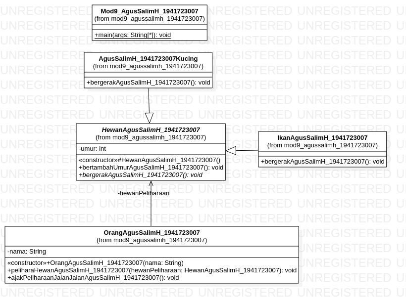
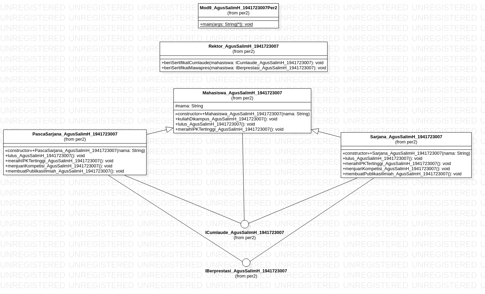
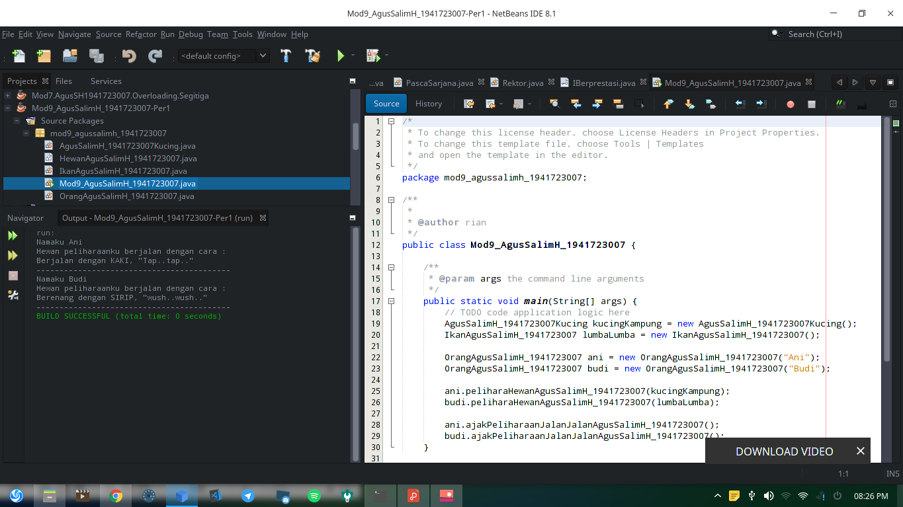
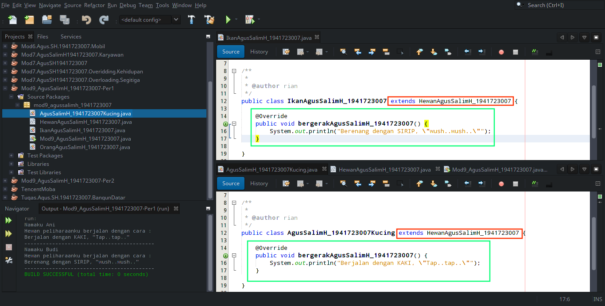

# LAPORAN MODUL 9 Abstract_Class_dan_Interface

## KOMPETENSI
    Setelah menyelesaikan lembar kerja ini mahasiswa diharapkan mampu:
    1. Menjelaskan maksud dan tujuan penggunaan Abstract Class;
    2. Menjelaskan maksud dan tujuan penggunaan Interface;
    3. Menerapkan Abstract Class dan Interface di dalam pembuatan program.

## Abstract Class
    Abstract Class adalah class yang tidak dapat diinstansiasi namun dapat di-extend. Abstract class baru
    dapat dimanfaatkan ketika ia di-extend.

## DIAGRAM CLASS
1. PERCOBAAN 1
]
2. PERCOBAAN 2
]

## PERCOBAAN 1

 link kode program: 
 [Main_Program](../../src/9_Abstract_Class_dan_Interface/percobaan_1/Mod9_AgusSalimH_1941723007.java)
  
 [Class_Kucing](../../src/9_Abstract_Class_dan_Interface/percobaan_1/AgusSalimH_1941723007Kucing.java)
   
 [Class_Hewan](../../src/9_Abstract_Class_dan_Interface/percobaan_1/HewanAgusSalimH_1941723007.java)
    
 [Class_Ikan](../../src/9_Abstract_Class_dan_Interface/percobaan_1/IkanAgusSalimH_1941723007.java)
    
 [Class_Orang](../../src/9_Abstract_Class_dan_Interface/percobaan_1/OrangAgusSalimH_1941723007.java)

### SOAL PERCOBAAN
    Bolehkah apabila sebuah class yang meng-extend suatu abstract class tidak 
    mengimplementasikan method abstract yang ada di class induknya? Buktikan!

    Jawab : Boleh

## PERCOBAAN 2

### SOAL PERCOBAAN
    a. Mengapa pada langkah nomor 9 terjadi error? Jelaskan!
    b. Dapatkah method kuliahDiKampus() dipanggil dari objek sarjanaCumlaude di class
    Program? Mengapa demikian?
    c. Dapatkah method kuliahDiKampus() dipanggil dari parameter mahasiswa di method 
    beriSertifikatCumlaude() pada class Rektor? Mengapa demikian?
    d. Modifikasilah method beriSertifikatCumlaude() pada class Rektor agar hasil eksekusi 
    class Program menjadi seperti berikut ini: