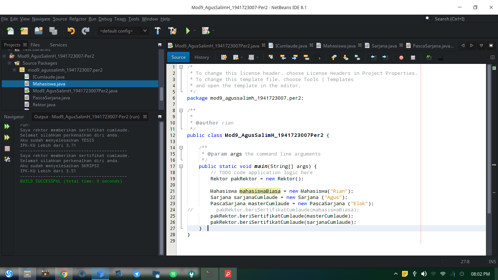
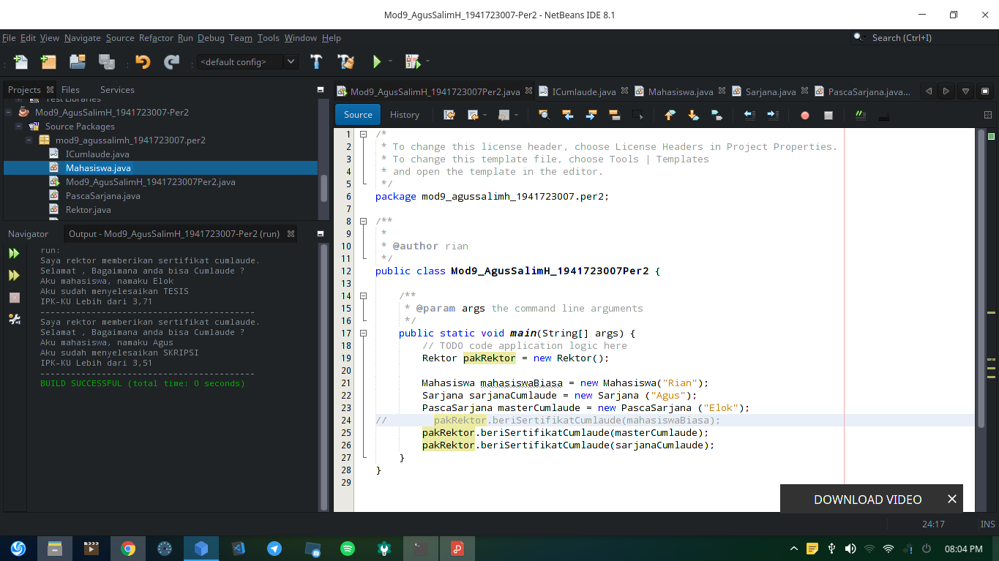
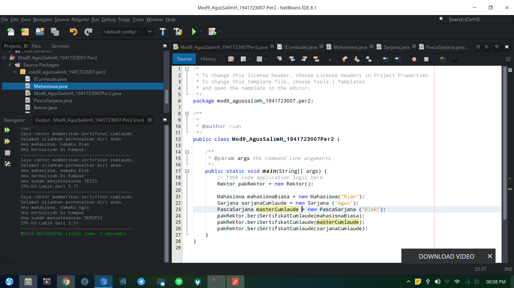
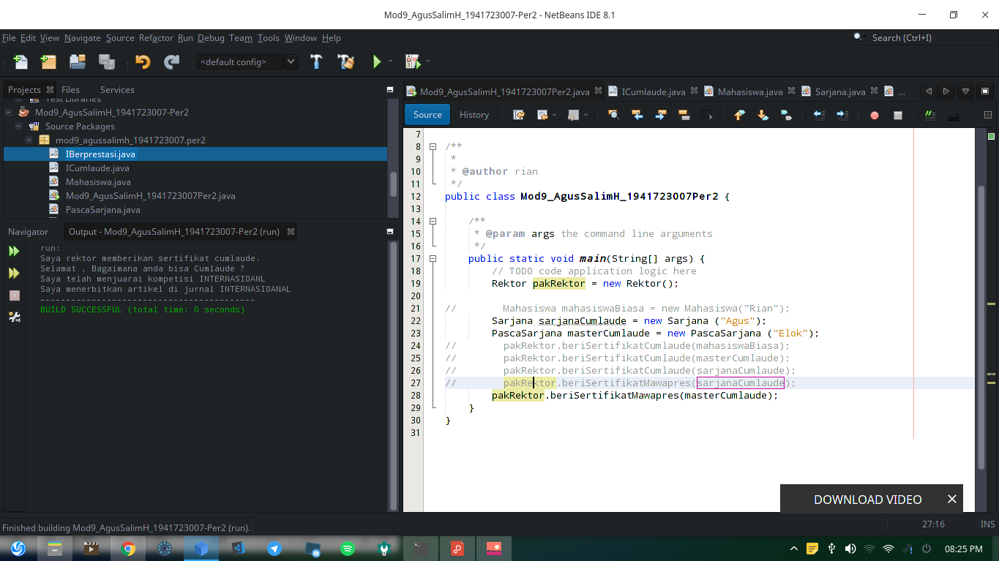
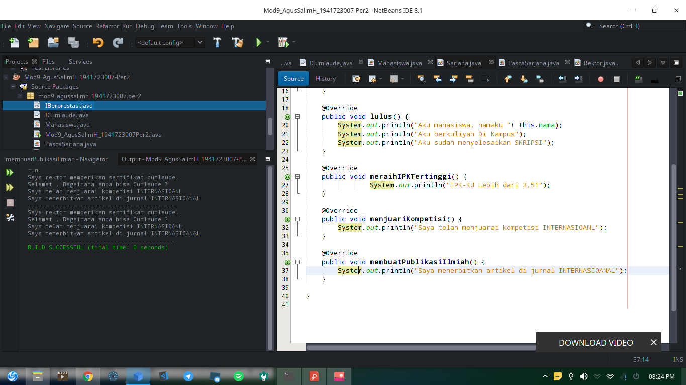

# LAPORAN MODUL 9 Abstract_Class_dan_Interface

## KOMPETENSI
    Setelah menyelesaikan lembar kerja ini mahasiswa diharapkan mampu:
    1. Menjelaskan maksud dan tujuan penggunaan Abstract Class;
    2. Menjelaskan maksud dan tujuan penggunaan Interface;
    3. Menerapkan Abstract Class dan Interface di dalam pembuatan program.

## Abstract Class
    Abstract Class adalah class yang tidak dapat diinstansiasi namun dapat di-extend. Abstract class baru
    dapat dimanfaatkan ketika ia di-extend.

## DIAGRAM CLASS
1. PERCOBAAN 1
]
2. PERCOBAAN 2
]

## PERCOBAAN 1

 link kode program: 

 [Main_Program](../../src/9_Abstract_Class_dan_Interface/percobaan_1/Mod9_AgusSalimH_1941723007.java)
  
 [Class_Kucing](../../src/9_Abstract_Class_dan_Interface/percobaan_1/AgusSalimH_1941723007Kucing.java)
   
 [Class_Hewan](../../src/9_Abstract_Class_dan_Interface/percobaan_1/HewanAgusSalimH_1941723007.java)
    
 [Class_Ikan](../../src/9_Abstract_Class_dan_Interface/percobaan_1/IkanAgusSalimH_1941723007.java)
    
 [Class_Orang](../../src/9_Abstract_Class_dan_Interface/percobaan_1/OrangAgusSalimH_1941723007.java)

### SOAL PERCOBAAN
    Bolehkah apabila sebuah class yang meng-extend suatu abstract class tidak 
    mengimplementasikan method abstract yang ada di class induknya? Buktikan!

    Jawab : Boleh

## PERCOBAAN 2
`Percobaan 1`

 

`Percobaan 2`

 

`Percobaan 3`

 

`Percobaan 4`

 

`Percobaan 5`

 

`Percobaan 6`

 
 link kode program: 
 
 [Main_Program](../../src/9_Abstract_Class_dan_Interface/percobaan_2/Mod9_AgusSalimH_1941723007Per2.java)
  
 [ Interface_IBerprestasi](../../src/9_Abstract_Class_dan_Interface/percobaan_2/IBerprestasi_AgusSalimH_1941723007.java)
  
 [ Interface_ICumlaude](../../src/9_Abstract_Class_dan_Interface/percobaan_2/ICumlaude_AgusSalimH_1941723007.java)
  
 [ Class_Mahasiswa ](../../src/9_Abstract_Class_dan_Interface/percobaan_2/Mahasiswa_AgusSalimH_1941723007.java)
  
 [ Class_Rektor ](../../src/9_Abstract_Class_dan_Interface/percobaan_2/Rektor_AgusSalimH_1941723007.java)
  
 [ Class_Sarjana ](../../src/9_Abstract_Class_dan_Interface/percobaan_2/Sarjana_AgusSalimH_1941723007.java)
  
 [ Class_PascaSarjana](../../src/9_Abstract_Class_dan_Interface/percobaan_2/PascaSarjana_AgusSalimH_1941723007.java)
  
### SOAL PERCOBAAN
    a. Mengapa pada langkah nomor 9 terjadi error? Jelaskan!
    Jawab : karena class Mahasiswa belum implements ke Icumlaude
    b. Dapatkah method kuliahDiKampus() dipanggil dari objek sarjanaCumlaude di class
    Program? Mengapa demikian?
    Jawab : Tidak, Karena bukan salah satu method dari Class Interface
    c. Dapatkah method kuliahDiKampus() dipanggil dari parameter mahasiswa di method 
    beriSertifikatCumlaude() pada class Rektor? Mengapa demikian?
    Jawab : Tidak Kecuali kalau di class interface di tambah method kuliyahDikampus()
    d. Modifikasilah method beriSertifikatCumlaude() pada class Rektor agar hasil eksekusi 
    class Program menjadi seperti berikut ini:
Jawab : 
`Modifikasi beriSertifikatCumlaude()`